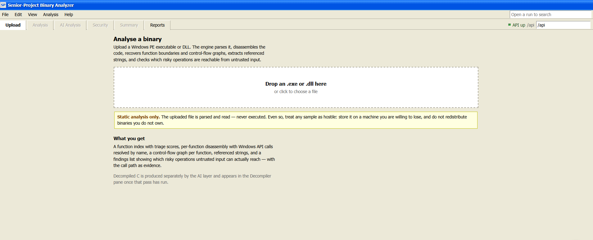

# Senior-Project — AI-assisted binary analysis for Windows PE

Upload a Windows `.exe` and get back disassembly, per-function control-flow
graphs, cross-references, a call graph, security findings, and a report on the
binary's exploit mitigations — in a browser, with a language model available to
explain any function without ever being allowed to overrule the analysis.

Four components, in one repository:

```
   browser                 Node/Express              C++ engine
┌──────────────┐        ┌──────────────┐        ┌──────────────────┐
│ frontend-    │  HTTP  │  backend/    │ spawn  │ Senior-Project/  │
│ react/       │◀──────▶│  server.js   │───────▶│ sp.exe           │
└──────────────┘        └──────┬───────┘        └──────────────────┘
                               │  POST                    │ writes
                               ▼                          ▼
                        ┌──────────────┐          analysis/*.json
                        │  n8n + LLM   │
                        │  (optional)  │
                        └──────────────┘
```

The engine runs once per upload and writes JSON. The backend serves that JSON
and never re-parses the binary. The AI layer is optional and additive: with it
switched off, every static result is still there.



Analysis is streamed rather than reported at the end — the stages are the
pipeline's own, and the reachability line appears as soon as that pass finishes,
before the JSON is written:


## Getting started

**[RUNNING.md](RUNNING.md) is the guide.** The short version, once the engine is
built:

```
start-dev.bat
```

Then open <http://localhost:5173> and upload `C:\Windows\System32\notepad.exe`.
That script starts both processes, checks the engine exists, installs
dependencies on first run, and writes `backend/.env` pointing at your `sp.exe`.

Only the C++ engine has to be built by hand — see
[Building the engine](#building-the-engine) below. The AI layer needs an n8n
instance and your own model API key; everything else works without it.

## Documentation

| Document | What it covers |
|---|---|
| [RUNNING.md](RUNNING.md) | Running it end to end, what you should see, troubleshooting |
| [backend/README.md](backend/README.md) | The API: routes, storage layout, engine invocation |
| [backend/N8N.md](backend/N8N.md) | Wiring the AI layer: webhook, callbacks, the two addresses that must be right |
| [docs/json-schema.md](docs/json-schema.md) | Every JSON document the engine emits — the contract all three consumers build against |
| [demo/DEMO.md](demo/DEMO.md) | The hardening demonstration, with a purpose-built target and its C source |
| [frontend-react/README.md](frontend-react/README.md) | UI structure and panes |

## Repository layout

```
├── Senior-Project/       C++ analysis engine  → sp.exe
├── tests/                engine test suite — 93 cases, dependency-free
├── backend/              Node/Express API over sp.exe
├── frontend-react/       React UI
├── docs/                 JSON schema, fixtures, n8n workflow, report
├── demo/                 hardening demo: target, its C source, before/after
└── start-dev.bat         starts the backend and the frontend together
```

`docs/n8n-workflow.json` is importable into n8n as-is; it carries placeholder
credentials, not real ones.

---

The rest of this document describes the C++ engine.

## Design premise

Most disassemblers were built for a human reading a GUI. Analysis runs once,
commits to its conclusions, and discards the reasoning that produced them. When
the tool guesses wrong about whether bytes are code, the output looks exactly as
confident as when it is right.

That is a poor foundation for a system where a language model is also a consumer
of the analysis. This engine is built around four properties instead:

**1. Provenance on every derived fact.** Each instruction records *why* we
believe it is an instruction — entry point, `.pdata` unwind info, direct call
target, prologue heuristic, or linear-sweep guess. See `core/Provenance.h`.

**2. Graded confidence, not assertion.** Code/data classification is a lattice,
not a boolean. Weaker evidence can never overwrite stronger, so results do not
depend on pass ordering. See `core/Confidence.h`, `disasm/CodeMap.h`.

**3. Facts separated from inference.** `db/FactStore` holds what was read from
the file and is never mutated by analysis. `db/AnnotationStore` holds names,
types, comments and tags, each tagged with its origin (analysis, user, or AI).
Re-analysis discards its own prior output while preserving human and model
contributions.

**4. Revisable analysis.** Because beliefs carry provenance and identity is
stable (`db/EntityId.h`), a later pass can retract a bad decode and rebuild only
what depended on it. `Pipeline::retract_region` is the entry point. This is what
makes an AI feedback loop possible: a model inference lands as an annotation,
propagates through re-analysis, and improves the context the model sees next.

That separation is visible on disk. A run directory keeps `analysis/` (written
once by the engine, never modified) apart from `ai/` (everything a model said).
Delete `ai/` and a complete static analysis remains.

## Engine layout

```
Senior-Project/
├── CMakeLists.txt          # sp_engine library + sp_cli executable
├── include/sp/
│   ├── Pipeline.h          # orchestration; owns all analysis state
│   ├── core/               # Types, AddressSpace, Confidence,
│   │                       # Provenance, Error, Log
│   ├── db/                 # EntityId, FactStore, AnnotationStore
│   ├── loader/             # BinaryLoader — the only LIEF consumer
│   ├── disasm/             # Disassembler, InstructionInfo/Storage,
│   │                       # DecodeQueue, CodeMap
│   ├── analysis/           # FunctionDiscovery, CFG, CFGBuilder,
│   │                       # CallGraph, XrefTable, SymbolTable,
│   │                       # ApiClassifier, Reachability,
│   │                       # StringExtractor, FunctionSummarizer,
│   │                       # LoopAnalysis
│   ├── lift/               # StructuralAnalysis, ContextBuilder
│   ├── harden/             # PeHardener — the only writer of binaries
│   └── serialize/          # JsonExporter, DotExporter
├── src/                    # mirrors include/sp exactly
└── tools/cli/main.cpp      # thin CLI wrapper, no analysis logic
```

`src/` mirrors `include/sp/` file for file, so the implementation of any header
is found by swapping the directory and the extension.

Dependencies are confined: only `src/loader/BinaryLoader.cpp` includes LIEF,
only `src/disasm/Disassembler.cpp` includes Capstone, and no public header
includes either. Both are linked `PRIVATE`, so nothing else in the project — or
anything linking `sp_engine` — inherits them. Adding ELF support later means
adding a loader, not editing the analysis layer.

## Pipeline

`src/Pipeline.cpp` runs these in order, each stage commented with why it sits
where it does.

```
BinaryLoader      PE → FactStore (sections, imports, exports, .pdata, TLS)
      ↓
Disassembler      recursive descent from trusted entry points,
                  then linear sweep over unclaimed bytes at Low confidence
      ↓
FunctionDiscovery .pdata → exports/entry → call targets → prologue patterns
      ↓
CFGBuilder        per-function basic blocks and edges
      ↓
XrefTable         bidirectional cross-references
CallGraph         function-to-function edges
StringExtractor   literals, and which functions reference them
      ↓
ApiClassifier     which imports are input sources, which are risky sinks
Reachability      call paths from a source to a sink — the findings layer
      ↓
LoopAnalysis      dominators, natural loops, nesting          (stub)
StructuralAnalysis  if/else, while, switch recovery           (stub)
      ↓
ContextBuilder    per-function bundle for the model           (stub)
JsonExporter      one document serving both the UI and the AI layer
```

The three stubbed stages are marked because the pipeline runs without them: they
contribute nothing to the export today rather than blocking it.

Disassembly strategy matters here. Recursive descent alone misses code reachable
only through indirect calls; linear sweep alone misdecodes data embedded in
`.text`. Running descent first from trusted sources, then sweeping the remainder
at explicitly lower confidence, gets the coverage of both while keeping the two
distinguishable in the output.

## Building the engine

Requires CMake 3.20+, a C++20 compiler (MSVC), LIEF 0.17.x and Capstone.

**Capstone** comes from vcpkg:

```
vcpkg install capstone:x64-windows-static
```

**LIEF** is a prebuilt SDK you download and unpack yourself — it is not fetched
by the build. Take the Windows x64 archive from
<https://github.com/lief-project/LIEF/releases> (0.17.x), unpack it anywhere,
and point `LIEF_ROOT` at the folder containing `lib/cmake/LIEF`:

```
cmake -S . -B out/build/x64-release -DCMAKE_BUILD_TYPE=Release -DLIEF_ROOT=C:/libs/LIEF-0.17.6-win64
cmake --build out/build/x64-release
ctest --test-dir out/build/x64-release
```

`LIEF_ROOT` may also be set as an environment variable, so the path never has to
be committed. The MSVC runtime must match the LIEF build — Release uses `/MT`; a
Debug build requires a Debug LIEF, and mismatching them produces link errors
rather than a clear message.

The binary lands at `out/build/x64-release/Senior-Project/sp.exe`, which is what
`backend/.env` must point at.

## CLI

```
sp info      <binary>            headers, sections, imports, coverage
sp functions <binary>            discovered function index
sp disasm    <binary> --at VA    disassemble one function
sp cfg       <binary> --at VA    CFG of one function as JSON
sp dot       <binary> --at VA    CFG as Graphviz (development aid)
sp callgraph <binary>            whole-image call graph
sp findings  <binary>            risky operations + input reachability
sp export    <binary> --out DIR  manifest + per-function JSON (what the backend runs)

sp mitigations <binary>          report ASLR/DEP/CFG state, changes nothing
sp harden      <binary> --out F  write a copy with mitigations enabled
```

`harden` never writes in place. The input is the evidence every stored finding
was derived from, and overwriting it would destroy that.

## Status

**Working end to end** (v1 spine complete): PE loading, disassembly with
recursive descent plus linear-sweep fallback, function discovery from four
sources, per-function CFG construction, cross-references, call graph, symbol
resolution, string extraction, reachability-based findings, and JSON/Graphviz
export.

Implemented and unit tested — 93 cases, all passing: `core` (all), `db`
(all), `PeFormat`, `InstructionStorage`, `CodeMap`, `DecodeQueue`, `CFG`,
`CFGBuilder`, `SymbolTable`, `XrefTable`, `CallGraph`, `AnnotationStore`,
`ApiClassifier`, `Reachability`, `StringExtractor`, `JsonExporter`,
`PeHardener`.

The suite is assert-based and dependency-free, so `ctest` needs nothing
installed beyond what the engine already required.

Implemented, verified by build only (require LIEF/Capstone): `BinaryLoader`,
`Disassembler`, `DotExporter`, `Pipeline`.

**Security findings are implemented**, in `analysis/` rather than a `findings/`
directory: `ApiClassifier` labels imports as input sources or risky sinks, and
`Reachability` looks for a call path between them. It is explicitly not taint
analysis — a path proves a necessary condition for exploitability, not a
sufficient one, and the output is worded to say so.

**Mitigation hardening is implemented** in `harden/PeHardener`, the only part of
the engine that writes a binary rather than reading one. It reports ASLR, DEP,
high-entropy ASLR, CFG and W^X, and can enable the first three — refusing ASLR
when there is no relocation data, refusing high-entropy ASLR on a 32-bit image,
and refusing to touch a signed image unless told to. CFG is reported and never
set, because it needs compiler-emitted guard tables; `/GS` is reported as
unrepresentable rather than absent, because stack cookies are code, not a header
bit. This does not repair the defects the analysis found — see the note at the
top of `PeHardener.h` for why that is deliberate rather than unfinished.

**Deferred, stubbed with the intended approach documented at each site:**
`LoopAnalysis` (dominators, dominance frontiers, natural loops — the accessors
are real but nothing populates them), `StructuralAnalysis::analyze` (if/else and
loop recovery; it returns a single honest `Irreducible` region holding the raw
blocks), `ContextBuilder::build` and `to_prompt_payload` (AI context bundles),
jump-table resolution, and patch proposals.

Two things inside those stubbed files *are* real and are relied on:
`StructuralAnalysis::cyclomatic_complexity` (E − N + 2, and the number the UI
shows), and `ContextBuilder::recommended_processing_order`, which delegates to
`CallGraph::reverse_topological_order` — implemented with Tarjan's SCC algorithm,
iterative to survive deep call chains, and reporting the cycles it finds. That is
what makes bottom-up lifting work, so a caller's prompt carries summaries of what
it calls.

Structural recovery being deferred is the architectural bet the project rests
on: the AI layer performs that job from the engine's blocks and edges, and the
engine's role is to give it facts it cannot get wrong.

## Output contract

`docs/json-schema.md` documents every JSON document the engine emits, and
`docs/fixtures/` holds hand-written samples. The backend API, n8n workflow and
frontend all build against that contract.

## How the AI layer is kept honest

The model is a consumer of the analysis, never an authority over it:

- **Severity is the engine's.** Every stored AI result has `severity_source`
  forced to `"engine"`. A model may explain a rating; it can never set one.
- **Corroboration is checked.** An AI issue is marked corroborated only when it
  names an engine finding that actually exists, per issue rather than per
  function.
- **Coverage is measured, not self-reported.** Generated C carries per-line
  block tags; the backend compares them against the real block list and reports
  what matched.
- **Results go stale.** Each bug result records which decompilation version it
  reasoned from, and is flagged when that text is replaced.
- **A human accepts or rejects.** Lifted output carries a review state and is
  never treated as established.
